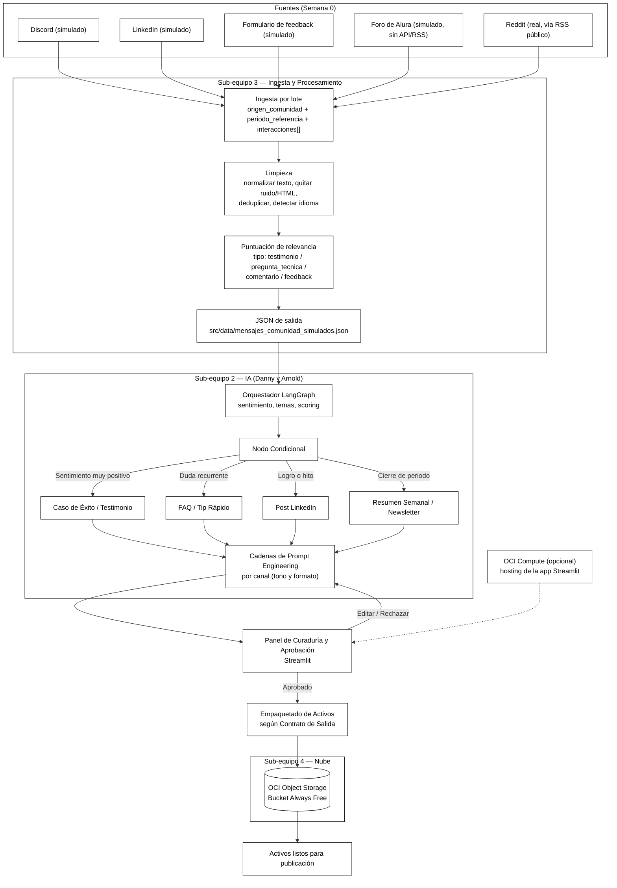

# Arquitectura de Solución — CommunityLab
**Hackathon ONE G10 — Oracle Next Education & Alura**

**Responsable:** Nelson Ramses Aviles Reyes — Arquitectura de Solución (Software / Solution Architect)
**Meta 0:** Definir el mapa conceptual del sistema y blindar la comunicación entre módulos.

> Nota de alcance: el equipo decidió construir el pipeline en **Python puro (LangGraph/LangChain + Streamlit)**, descartando n8n — opción explícitamente permitida por las bases del hackathon.
>
> **Estado de integración (Semana 0):** este documento ya incorpora el tramo de **Ingesta y Limpieza** entregado por Sub-equipo 3 (Gustavo Vásquez y Jhonattan Benavides, Data Analysts). Sigue pendiente integrar el diagrama de Frontend (Sebastián) y el de Nube/Cloud (Marco y Renato) para cerrar el mapa E2E completo.

---

## 1. Diagrama de Flujo E2E

> Este bloque se puede pegar directamente en el `README.md` del repo: GitHub renderiza Mermaid de forma nativa.

### Descripción de las etapas

| # | Etapa | Qué hace | Módulo responsable |
|---|-------|----------|---------------------|
| 1 | Fuentes | Semana 0 simula 4 orígenes (Discord, LinkedIn, formulario de feedback, foro de Alura) e ingiere Reddit de forma real vía RSS público | — |
| 2 | Ingesta por lote | Recibe el lote respetando el Contrato de Entrada oficial (`origen_comunidad`, `periodo_referencia`, `interacciones[]`) | Sub-equipo 3 |
| 3 | Limpieza | Normaliza texto, quita ruido/HTML, deduplica, detecta idioma | Sub-equipo 3 |
| 4 | Puntuación de relevancia | Prioriza testimonios, preguntas técnicas y feedback antes de pasarlos a la IA | Sub-equipo 3 |
| 5 | JSON de salida (intermedio) | Escribe `src/data/mensajes_comunidad_simulados.json`, ya con las extensiones internas `id`, `fecha`, `idioma` | Sub-equipo 3 |
| 6 | Orquestación (LangGraph) | Nodo condicional que decide qué tipo de activo generar según sentimiento/tema | Sub-equipo 2 (Danny, Arnold) |
| 7 | Generación de copy | Cadenas de prompt especializadas por canal | Sub-equipo 2 |
| 8 | Curaduría y aprobación | Panel Streamlit donde un humano revisa, edita o aprueba los activos | Frontend (Sebastián) |
| 9 | Persistencia | El paquete final (Contrato de Salida) se guarda en OCI Object Storage Always Free | Sub-equipo 4 (Marco, Renato) |
| 10 | Salida | Activos listos para publicar (LinkedIn, X, Newsletter, FAQ) | — |

---

## 2. Contrato de Datos (Esquema JSON)

Tres archivos de especificación técnica acompañan este documento:

- `contrato-entrada.schema.json` — el contrato **oficial con el cliente**, tal como lo definen las bases del proyecto. No se toca.
- `contrato-intermedio-ingesta.schema.json` — el archivo real que produce Sub-equipo 3 y consume Sub-equipo 2 (`mensajes_comunidad_simulados.json`); mismos nombres de campo que el de entrada, más 3 extensiones internas.
- `contrato-salida.schema.json` — la respuesta final con los activos de marketing y el resultado de la persistencia en OCI.

### 2.1 JSON de Entrada (contrato con el cliente — no se modifica)

| Campo | Tipo | Obligatorio | Descripción |
|---|---|---|---|
| `origen_comunidad` | string | Sí | Plataforma y grupo de origen del lote (ej. `Discord_Grupo_ONE_G10`) |
| `periodo_referencia` | string | Sí | Periodo que agrupa el lote (ej. `Semana_0`) |
| `interacciones[]` | array de objetos | Sí, mínimo 1 | Lista de mensajes/eventos a procesar |
| `interacciones[].autor` | string | Sí | Nombre o alias del autor |
| `interacciones[].canal` | string | Sí | Canal de origen (ej. `#logros-y-empleos`) |
| `interacciones[].tipo` | string (enum) | Sí | `testimonio`, `pregunta_tecnica`, `comentario`, `feedback` |
| `interacciones[].texto` | string | Sí | Contenido textual de la interacción, tal como llega de la fuente |

### 2.2 JSON Intermedio — Ingesta → IA (`mensajes_comunidad_simulados.json`)

Mismos campos que arriba, **más 3 extensiones internas** que añade Sub-equipo 3 sin tocar el contrato oficial:

| Campo nuevo | Tipo | Descripción |
|---|---|---|
| `interacciones[].id` | string | Identificador único asignado en ingesta |
| `interacciones[].fecha` | string (date-time) | Fecha/hora de la interacción original |
| `interacciones[].idioma` | string | Código de idioma detectado (ej. `es`, `en`, `pt`) |

El campo `texto` en este JSON ya viene limpio (normalizado, sin HTML/ruido, deduplicado).

### 2.3 JSON de Salida

| Campo | Tipo | Obligatorio | Descripción |
|---|---|---|---|
| `status` | string (enum) | Sí | `exito`, `parcial`, `error` |
| `resumen_comunidad.total_interacciones_procesadas` | integer | Sí | Conteo del lote |
| `resumen_comunidad.sentimiento_predominante` | string (enum) | Sí | `Altamente Positivo`, `Positivo`, `Neutral`, `Negativo`, `Altamente Negativo`, `Mixto` |
| `resumen_comunidad.temas_principales` | array<string> | Sí | Temas detectados en el lote |
| `activos_distribucion_generados` | object | Sí, mínimo 2 tipos | Contenedor de los activos generados (`post_linkedin`, `post_x`, `destaque_newsletter_semanal`, `sugerencia_contenido_faq`, `caso_testimonio`) |
| `almacenamiento_oci.bucket` | string | Sí | Nombre del bucket OCI |
| `almacenamiento_oci.ruta_objeto` | string | Sí | Ruta del objeto guardado |
| `almacenamiento_oci.status` | string (enum) | Sí | `guardado_con_exito`, `error_almacenamiento`, `pendiente` |
| `error.codigo` / `error.mensaje` | string | Solo si `status = error` | Detalle del error |

---

## 3. Comunicación entre módulos

- **Sub-equipo 3 (Ingesta)** es dueño del contrato intermedio: cualquier campo nuevo que necesiten agregar debe ir como extensión (como `id`/`fecha`/`idioma`), nunca rompiendo `autor`/`canal`/`tipo`/`texto` del contrato oficial.
- **Sub-equipo 2 (IA/LangGraph)** consume `src/data/mensajes_comunidad_simulados.json` y programa su análisis para que la salida encaje exactamente en `resumen_comunidad`, alimentando el nodo condicional con `sentimiento_predominante` y `temas_principales`.
- **Frontend (Streamlit)** consume `activos_distribucion_generados` tal cual para el panel de curaduría — no debería tener que transformar nombres de campos.
- **Sub-equipo 4 (Nube)** es dueño del bloque `almacenamiento_oci` y del bucket Always Free; cualquier cambio en el nombre del bucket o en la convención de `ruta_objeto` se actualiza aquí primero.
- Documentos de referencia ya generados por Sub-equipo 3 y citados en su diagrama: `proyecto_3_community_lab.md`, `fuentes_de_datos_acceso.md`, `criterio_puntuacion_relevancia.md` — vale la pena que vivan en el mismo repo/carpeta que estos contratos.

---

## 4. Supuestos y decisiones abiertas (a validar con el equipo)

- El enum `tipo` (`testimonio`, `pregunta_tecnica`, `comentario`, `feedback`) ya está confirmado por Sub-equipo 3, pero el brief original también menciona "entregas de proyecto" y "debates de foro" como fuentes de valor — falta confirmar si esas caen dentro de `comentario`/`feedback` o si se necesitan categorías nuevas.
- No es claro si la "puntuación de relevancia" de Sub-equipo 3 queda como un campo numérico explícito en `mensajes_comunidad_simulados.json` o si solo se usa para filtrar/ordenar antes de escribir el JSON — confirmar con Gustavo/Jhonattan para reflejarlo en el contrato intermedio si aplica.
- `activos_distribucion_generados` se modeló para exigir mínimo 2 propiedades (regla del MVP), no una lista fija — el equipo puede combinar, por ejemplo, `post_linkedin` + `sugerencia_contenido_faq`, o `caso_testimonio` + `destaque_newsletter_semanal`.
- Pendiente: integrar en este mismo diagrama el tramo de Frontend (Sebastián) y el de infraestructura Cloud más allá de Object Storage (Marco y Renato), para cerrar el mapa E2E completo que pide Meta 0.
