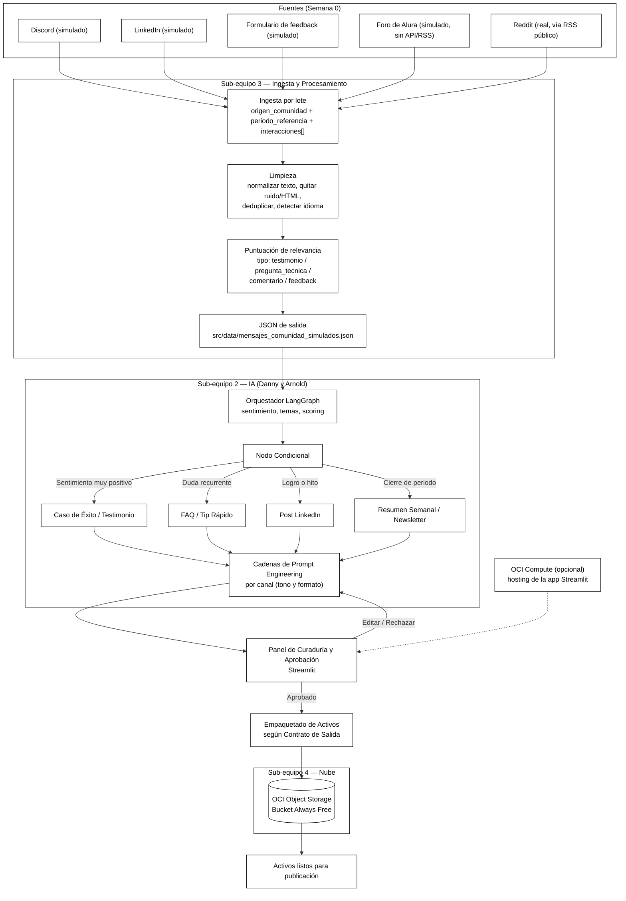

# Diagrama de Flujo E2E — CommunityLab

```mermaid
flowchart TD
    classDef default fill:#ffffff,stroke:#000000,color:#000000,stroke-width:1px;

    subgraph FUENTES["Fuentes (Semana 0)"]
        A1["Discord (simulado)"]
        A2["LinkedIn (simulado)"]
        A3["Formulario de feedback (simulado)"]
        A4["Foro de Alura (simulado, sin API/RSS)"]
        A5["Reddit (real, vía RSS público)"]
    end

    A1 --> B
    A2 --> B
    A3 --> B
    A4 --> B
    A5 --> B

    subgraph SUB3["Sub-equipo 3 — Ingesta y Procesamiento"]
        B["Ingesta por lote<br/>origen_comunidad + periodo_referencia + interacciones[]"]
        C["Limpieza<br/>normalizar texto, quitar ruido/HTML,<br/>deduplicar, detectar idioma"]
        D["Puntuación de relevancia<br/>tipo: testimonio / pregunta_tecnica /<br/>comentario / feedback"]
        E["JSON de salida<br/>src/data/mensajes_comunidad_simulados.json"]
        B --> C --> D --> E
    end

    subgraph SUB2["Sub-equipo 2 — IA (Danny y Arnold)"]
        F["Orquestador LangGraph<br/>sentimiento, temas, scoring"]
        F --> F1["Nodo Condicional"]
        F1 -->|Sentimiento muy positivo| G1["Caso de Éxito / Testimonio"]
        F1 -->|Duda recurrente| G2["FAQ / Tip Rápido"]
        F1 -->|Logro o hito| G3["Post LinkedIn"]
        F1 -->|Cierre de periodo| G4["Resumen Semanal / Newsletter"]
        G1 --> H
        G2 --> H
        G3 --> H
        G4 --> H
        H["Cadenas de Prompt Engineering<br/>por canal (tono y formato)"]
    end

    E --> F

    H --> I["Panel de Curaduría y Aprobación<br/>Streamlit"]
    I -->|Aprobado| J["Empaquetado de Activos<br/>según Contrato de Salida"]
    I -->|Editar / Rechazar| H

    subgraph SUB4["Sub-equipo 4 — Nube"]
        K[("OCI Object Storage<br/>Bucket Always Free")]
    end

    J --> K
    K --> L["Activos listos para publicación"]

    M["OCI Compute (opcional)<br/>hosting de la app Streamlit"] -.-> I

    style FUENTES fill:#ffffff,stroke:#000000,color:#000000
    style SUB3 fill:#ffffff,stroke:#000000,color:#000000
    style SUB2 fill:#ffffff,stroke:#000000,color:#000000
    style SUB4 fill:#ffffff,stroke:#000000,color:#000000
```
