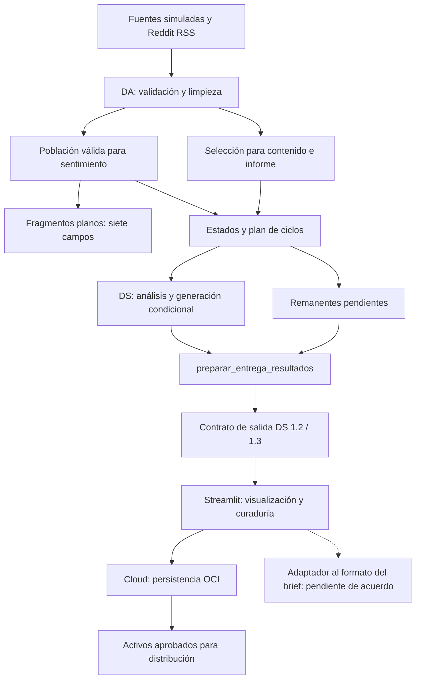

# Diagrama E2E — Semana 3

Elegible_faq y score_relevancia viajan en los estados, no en los fragmentos planos.
Fallos y pendientes se conservan explícitamente. El diagrama describe responsabilidades;
no acredita que todos los PR estén fusionados ni que la publicación sea automática.
