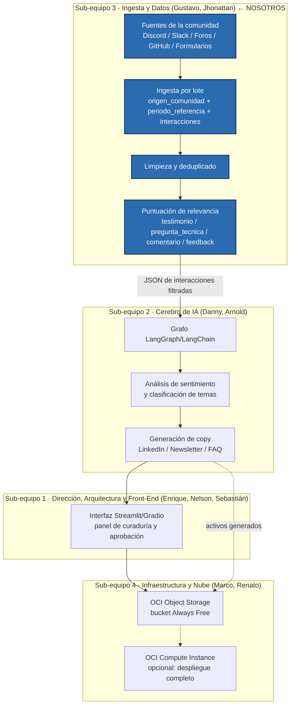

# Arquitectura general del sistema — CommunityLab

Aproximación de la arquitectura completa del proyecto (los 4 sub-equipos definidos
en la reunión de Semana 0), para ubicar el aporte de Ingesta y Procesamiento de
Datos (Sub-equipo 3: Gustavo Vásquez y Jhonattan Benavides) dentro del pipeline
general. El diagrama detallado del tramo de ingesta está en
[`diagrama_flujo_datos_ingesta.md`](./diagrama_flujo_datos_ingesta.md); este
documento da la vista de conjunto.

## Diagrama

## Ubicación de nuestro aporte

Sub-equipo 3 es el **punto de entrada** del pipeline: todo lo que llega de la
comunidad pasa primero por nuestro tramo (ingesta → limpieza → puntuación de
relevancia) antes de convertirse en el JSON que consume el Sub-equipo 2 para el
análisis de IA. Cualquier problema de calidad de datos aquí se propaga a todo el
resto del sistema, por lo que el esquema de entrada (`origen_comunidad` /
`periodo_referencia` / `interacciones`) y el criterio de relevancia son las piezas
más críticas de esta etapa.

## Notas

- Vista de conjunto en Semana 0, basada en la estructura de sub-equipos y el flujo
  descrito en `proyecto_3_community_lab.md` y en la reunión del 14 de septiembre.
- Nelson (Solution Architect) es quien valida/ajusta el diagrama de arquitectura
  definitivo del sistema; este documento es el aporte de datos a esa definición.
