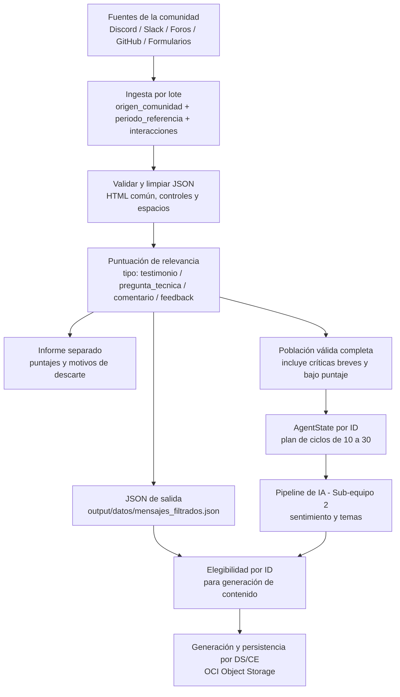

# Diagrama de flujo de datos — Ingesta y Procesamiento (Sub-equipo 3)

Aporte de Gustavo Vásquez y Jhonattan Benavides (Data Analysts) al diagrama de flujo
general del sistema que coordina Nelson Ramses Avilés (Solution Architect). Cubre
únicamente el tramo de **ingesta y limpieza de datos**, desde que llega un mensaje de
la comunidad hasta que sale como JSON listo para el pipeline de IA (Sub-equipo 2).

## Diagrama

## Descripción de cada etapa

1. **Fuentes de la comunidad**: según el brief oficial del proyecto
   (`proyecto_3_community_lab.md`), el sistema debe poder ingerir datos de Discord,
   Slack, foros, GitHub o formularios. En Semana 0 se simulan cuatro orígenes
   representativos: Discord, LinkedIn, un formulario de feedback y el foro de
   Alura (este último simulado porque requiere login y no expone API/RSS
   pública — ver [`fuentes_de_datos_acceso.md`](./fuentes_de_datos_acceso.md)).
   Además, Reddit se ingiere de forma **real** (no simulada) vía RSS público.
2. **Ingesta por lote**: cada lote de entrada respeta el esquema exacto especificado
   por el cliente: `origen_comunidad` (plataforma de origen), `periodo_referencia`
   (semana/periodo cubierto) e `interacciones` (lista de mensajes con `autor`,
   `canal`, `tipo` y `texto`). El equipo añade `id`, `fecha` e `idioma` como
   extensiones internas, sin romper el contrato original.
3. **Limpieza**: `ingest.py` valida campos y limpia HTML común, caracteres de
   control y espacios. Conserva mayúsculas, tildes y emojis. El idioma proviene
   de la fuente, no se detecta automáticamente. La deduplicación por lote se
   aplica durante la selección y queda explicada en el informe.
4. **Puntuación de relevancia**: aplica el criterio descrito en
   [`criterio_puntuacion_relevancia.md`](./criterio_puntuacion_relevancia.md) para
   priorizar los mejores testimonios, preguntas técnicas o piezas de feedback antes
   de pasarlos a la IA.
5. **JSON de salida**: `output/datos/mensajes_filtrados.json` conserva el esquema
   de entrada con las interacciones seleccionadas para generar contenido. El
   archivo simulado original se conserva. Para sentimiento general se debe usar
   la entrada completa limpiada, evitando el sesgo de la selección de marketing.
6. **Entrega de Semana 1**: `--entrega-ia DIR` exporta población válida, estados
   iniciales de IA y un plan por IDs. Los fragmentos planos preservan el origen;
   los ciclos operativos agrupan estados de 10 a 30, con remanentes explícitos.
   El algoritmo no ejecuta IA. DS debe usar la población completa para análisis
   y los IDs elegibles para generación. Véase el [contrato](contrato_datos_ingesta.md).
7. **Ejecución y almacenamiento**: punto de integración con el trabajo de Danny y
   Arnold (Sub-equipo 2) y con la persistencia obligatoria en OCI Object Storage
   (Sub-equipo 4), ambos fuera del alcance de este sub-equipo.

## Notas

- Este es el aporte de la parte de **Datos/Ingesta** al diagrama completo del sistema;
  Nelson integra este tramo con arquitectura, frontend (Sebastián) y nube (Marco y
  Renato) para el diagrama general.
- Validado contra la documentación oficial del proyecto
  (`proyecto_3_community_lab.md`): el esquema de `src/data/mensajes_comunidad_simulados.json`
  se ajustó para calzar exactamente con el ejemplo de solicitud (`origen_comunidad`,
  `periodo_referencia`, `interacciones`) definido por el cliente.
