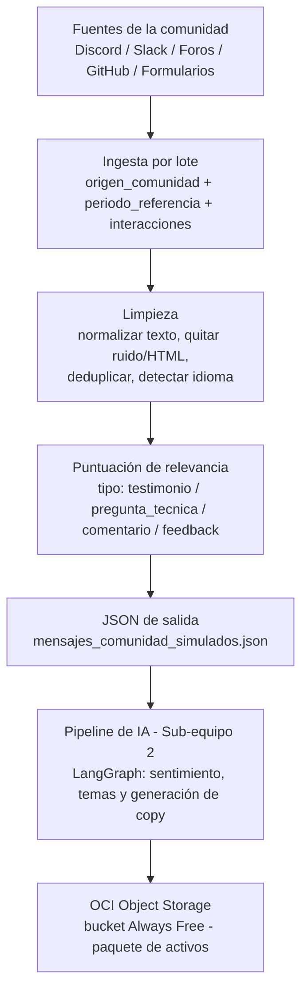

# Diagrama de flujo de datos — Ingesta y Procesamiento (Sub-equipo 3)

Aporte de Gustavo Vásquez y Jhonattan Benavides (Data Analysts) al diagrama de flujo
general del sistema que coordina Nelson Ramses Avilés (Solution Architect). Cubre
únicamente el tramo de **ingesta y limpieza de datos**, desde que llega un mensaje de
la comunidad hasta que sale como JSON listo para el pipeline de IA (Sub-equipo 2).

## Diagrama

## Descripción de cada etapa

1. **Fuentes de la comunidad**: según el brief oficial del proyecto
   (`proyecto_3_community_lab.md`), el sistema debe poder ingerir datos de Discord,
   Slack, foros, GitHub o formularios. En Semana 0 se simulan tres orígenes
   representativos: Discord, LinkedIn y un formulario de feedback.
2. **Ingesta por lote**: cada lote de entrada respeta el esquema exacto especificado
   por el cliente: `origen_comunidad` (plataforma de origen), `periodo_referencia`
   (semana/periodo cubierto) e `interacciones` (lista de mensajes con `autor`,
   `canal`, `tipo` y `texto`). El equipo añade `id`, `fecha` e `idioma` como
   extensiones internas, sin romper el contrato original.
3. **Limpieza**: normalización de texto (minúsculas, espacios), eliminación de ruido
   (HTML, emojis rotos), deduplicado de interacciones repetidas y detección de
   idioma.
4. **Puntuación de relevancia**: aplica el criterio descrito en
   [`criterio_puntuacion_relevancia.md`](./criterio_puntuacion_relevancia.md) para
   priorizar los mejores testimonios, preguntas técnicas o piezas de feedback antes
   de pasarlos a la IA.
5. **JSON de salida**: estructura final (`src/data/mensajes_comunidad_simulados.json`)
   que consume el Sub-equipo 2 para el análisis de sentimiento, clasificación de
   temas y generación de copy en LangGraph.
6. **Entrega a IA y almacenamiento**: punto de integración con el trabajo de Danny y
   Arnold (Sub-equipo 2) y con la persistencia obligatoria en OCI Object Storage
   (Sub-equipo 4), ambos fuera del alcance de este sub-equipo.

## Notas

- Este es el aporte de la parte de **Datos/Ingesta** al diagrama completo del sistema;
  Nelson integra este tramo con arquitectura, frontend (Sebastián) y nube (Marco y
  Renato) para el diagrama general.
- Validado contra la documentación oficial del proyecto
  (`proyecto_3_community_lab.md`): el esquema de `src/data/mensajes_comunidad_simulados.json`
  se ajustó para calzar exactamente con el ejemplo de solicitud (`origen_comunidad`,
  `periodo_referencia`, `interacciones`) definido por el cliente.
