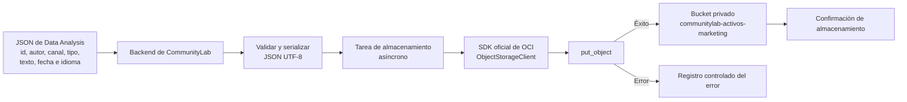

# Diagrama conceptual de persistencia con OCI

Este diagrama representa cómo el backend recibirá el JSON preparado por Data
Analysis y lo almacenará en OCI Object Storage mediante el SDK oficial `oci`.

## Flujo



## Mapeo conceptual

| Origen | Persistencia en OCI |
| --- | --- |
| JSON validado por Data Analysis | Cuerpo del objeto almacenado en formato JSON |
| `id` de la interacción | Identificador para conservar la trazabilidad |
| `origen_comunidad` y `periodo_referencia` | Datos para organizar la ruta del objeto |
| Configuración local o variables de entorno | Perfil, bucket y conexión del SDK |

Ejemplo de ruta conceptual:

```text
processed/2026/semana-02/int-022.json
```

Las credenciales y llaves de OCI permanecen fuera del repositorio. La lógica
Python del conector se desarrollará en `src/config/` durante la Semana 2.
