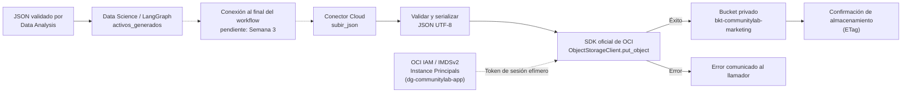

# Diagrama conceptual de persistencia con OCI

Este diagrama muestra cómo los activos generados por Data Science se guardarán
en OCI Object Storage mediante el SDK oficial `oci`. Data Analysis entrega el
JSON de entrada al flujo de IA; ese JSON no es el objeto que sube este conector.

## Flujo



## Mapeo conceptual

| Origen | Persistencia en OCI |
| --- | --- |
| JSON validado por Data Analysis | Entrada para Data Science; no lo sube este conector |
| `activos_generados[ruta]` | Cuerpo del objeto almacenado en formato JSON |
| `id`, `ruta` y `periodo` | Ruta `activos/{periodo}/{ruta}/{id}.json` para conservar la trazabilidad |
| OCI IAM (Instance Principals) / Variables de entorno | Autenticación mediante identidad de la VM y resolución del bucket `bkt-communitylab-marketing` |

Ejemplo de ruta conceptual:

```text
activos/2026-semana-02/linkedin/int-022.json
```

Las credenciales de OCI permanecen fuera del repositorio. El conector
de Semana 2, propuesto en el PR #12 (`src/config/oci_client.py`), permite la
subida directa. La conexión automática al final del workflow y el
almacenamiento asíncrono siguen pendientes para Semana 3.
