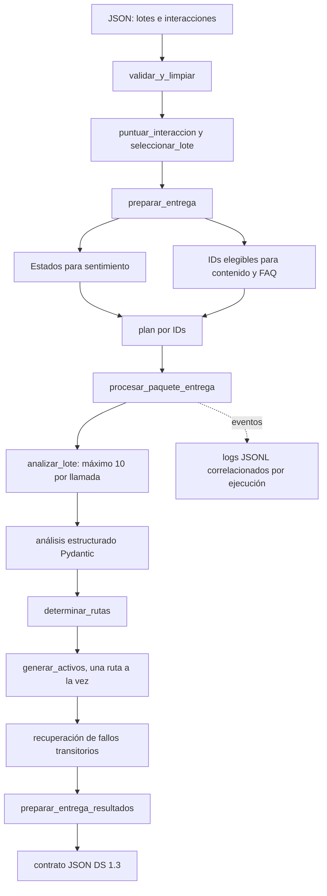

# Manual maestro de lectura del código de CommunityLab

Este documento es una guía de lectura y mantenimiento del repositorio. Explica
cómo seguir una interacción desde el JSON de entrada hasta el análisis, las
rutas, los activos y el contrato de salida; también sirve como índice de cada
archivo Python, prueba, script y dato de referencia.

El manual está escrito en Markdown para que pueda mantenerse junto con el
código. Puede convertirse a PDF cuando se quiera distribuir una edición fija.
Si algo aquí contradice a la implementación, el código y sus pruebas son la
fuente de verdad: actualiza este documento al cambiar el comportamiento.

## Cómo aprovecharlo

Hay tres formas de leer el proyecto:

1. **Recorrido completo:** sigue el orden de lectura propuesto y luego el
   recorrido de ejecución.
2. **Cambio puntual:** busca el archivo en el índice por responsabilidad,
   identifica su prueba y ejecuta primero esa prueba.
3. **Incidente:** busca el ID, etapa o ruta en el resultado, luego en los logs y
   finalmente en el módulo que produjo ese campo.

La cobertura de este manual incluye los 57 archivos `.py` que Pylance reconoce
en `src/`, `scripts/` y `tests/`, además de la configuración y los JSON de
entrada o referencia principales. Los módulos `__init__.py` vacíos se indican
como tales; no contienen comportamiento escondido.

## Recorrido recomendado

Lee en este orden para construir el modelo mental sin saltar entre capas:

1. [README del proyecto](../README.md): propósito, flujo y comandos básicos.
2. [Datos simulados](../src/datos/mensajes_comunidad_simulados.json): forma real
   de la entrada.
3. [Ingesta y limpieza](../src/datos/ingesta.py): validación, scoring, estados,
   ciclos y CLI.
4. [Criterio de relevancia](../src/datos/relevancia.py): decisión determinista
   de selección y evidencia.
5. [Entrega a IA](../src/datos/entrega_ia.py): separación de poblaciones y
   armado del plan.
6. [Estado interno](../src/agentes/estado_agente.py) y
   [modelos estructurados](../src/agentes/modelos.py): datos que cruzan los
   nodos y esquemas que valida Pydantic.
7. [Analizador](../src/agentes/nodos/nodo_analizador.py),
   [enrutador](../src/agentes/nodos/nodo_enrutador.py) y
   [generadores](../src/agentes/nodos/nodos_generadores.py): decisiones del
   agente.
8. [Grafo](../src/agentes/grafo.py) y
   [procesamiento del paquete](../src/agentes/procesamiento.py): orden de
   ejecución, lotes y pendientes.
9. [Reintentos](../src/agentes/reintentos.py),
   [recuperación](../src/agentes/recuperacion.py) y
   [observabilidad](../src/agentes/observabilidad.py): fallos y seguimiento.
10. [Contrato público](../src/agentes/contrato_salida_ciencia_datos.py) y
    [preparación de salida](../src/agentes/entrega_resultados.py): forma que
    recibe otra aplicación.
11. [Evaluación](../src/evaluacion.py) y
    [suite de pruebas](../tests/): cómo se verifica cada frontera.

## Mapa mental



El flujo de la IA no decide qué mensajes entran a sentimiento. Datos crea una
población de análisis y, por separado, un conjunto de IDs elegibles para
contenido. Un mensaje puede analizarse aunque no se le permita generar activos.
Las preguntas del programa tienen además una elegibilidad FAQ propia.

## Conceptos y contratos

| Concepto | Qué significa en este código |
| --- | --- |
| Lote de Datos | Objeto con `origen_comunidad`, `periodo_referencia` e `interacciones`. El contenedor puede tener varios lotes y `metadata`. |
| Interacción | Mensaje original con ID, autor, canal, tipo preliminar, texto, fecha e idioma. |
| `tipo` / `tipo_original` | Etiqueta preliminar de Datos: `testimonio`, `pregunta_tecnica`, `comentario` o `feedback`. Se conserva para comparar; Gemini vuelve a clasificar semánticamente. |
| `EstadoAgente` | Estado interno parcial que fluye por LangGraph. Incluye entrada, clasificación, rutas, activos y errores. |
| `ids_contenido` | Conjunto/lista de IDs habilitados para generar activos. La pertenencia por ID prevalece sobre el puntaje dentro del consumidor. |
| Ciclo de procesamiento | Grupo de IDs descrito por el plan de Datos. Puede ser mayor que una llamada del modelo; el grafo lo subdivide en lotes de hasta 10. |
| Ruta | Tipo de activo que se permite intentar: FAQ, caso de éxito, boletín, LinkedIn o insight de mejora. |
| Fallo | Registro estructurado con etapa, ID opcional, ruta opcional, tipo, mensaje, intentos y condición de reintento. |
| Contrato de salida | `EntregaCienciaDatos`, versión `1.3`, pensado para otras capas. No es el mismo objeto que el paquete de entrada de DS. |

Hay dos taxonomías que no deben confundirse: el tipo preliminar de Datos no
incluye `pregunta_programa`; la clasificación de Ciencia de Datos sí la
incluye. La elegibilidad `elegible_faq` determina si una pregunta de programa
puede convertirse en FAQ.

## Recorrido de una interacción

### 1. Entrada y validación

La entrada principal es
[mensajes_comunidad_simulados.json](../src/datos/mensajes_comunidad_simulados.json).
Cada lote identifica origen y periodo; cada interacción contiene datos del
autor y el mensaje. `validar_y_limpiar()` en `src/datos/ingesta.py` acepta un
lote individual o un contenedor `{"metadata": ..., "lotes": [...]}`.

La validación exige objetos y listas en los niveles correctos, origen y periodo
no vacíos, los campos textuales esperados y uno de los cuatro tipos
preliminares. Si existen `id`, `fecha` o `idioma`, también deben ser texto no
vacío. La función trabaja sobre una copia profunda para no mutar la entrada.

`limpiar_texto()` desescapa entidades HTML, normaliza Unicode NFC, elimina
bloques `script` y `style`, retira etiquetas HTML conocidas, reemplaza
caracteres de control y colapsa espacios. No elimina expresiones técnicas como
`a < b` o `List<T>`.

### 2. Relevancia y selección

`puntuar_interaccion()` de `src/datos/relevancia.py` es determinista. No llama a
Gemini ni accede a la red. Calcula:

- puntos por tipo, según `puntos_por_tipo`;
- puntos por longitud, proporcionales al número de palabras y limitados a 20
  palabras;
- puntos por palabras clave únicas encontradas, limitados por
  `maximo_palabras`;
- puntos de frescura si la fecha está dentro del intervalo configurado.

La suma produce `puntaje`; la salida también explica cada aporte en `desglose`,
las palabras encontradas, los `motivos` de exclusión y las `advertencias` de
fecha. Una fecha ausente, inválida o futura no suma frescura. La fecha de
referencia se recibe como argumento para que el resultado sea reproducible.

`seleccionar_lote()` agrega motivos de texto corto, solo enlaces, repetición,
contenido eliminado, duplicado y bajo umbral. Después ordena candidatos por
puntaje descendente y, en empate, por orden de entrada. `maximo_por_lote`
limita la selección y agrega `fuera_maximo_por_lote` a los candidatos que
quedan fuera.

La configuración versionada está en
[relevancia.json](../configuracion/relevancia.json). Sus valores actuales
incluyen umbral 40, un mínimo de 20 caracteres, peso de tipo variable,
frescura de 7 días y máximo sin tope (`null`). La clase
`ConfiguracionRelevancia` valida límites y pesos antes de puntuar.

### 3. Dos poblaciones, no una

`preparar_entrega()` en `src/datos/entrega_ia.py` devuelve tres elementos:

- `completos`: interacciones incluidas en el análisis de sentimiento tras
  excluir ruido de calidad explícito;
- `contenido`: mensajes que superan la selección por puntaje y límite;
- `informe`: evaluación por mensaje, decisión y configuración usada.

Para sentimiento se excluyen duplicados, texto solo con enlaces, repetición,
contenido eliminado y texto vacío. Un mensaje corto, por debajo del umbral o
fuera del máximo por lote puede seguir en sentimiento. Esto evita que la
selección de marketing distorsione la lectura general de la comunidad.

`construir_estado_agente()` traduce una interacción a `EstadoAgente`: copia
autor, canal, texto, origen, tipo original y puntaje, además de ID e idioma si
están disponibles. `construir_estados_agente()` cruza interacción e informe por
ID, valida que la población solicitada esté completa, evita duplicados y
comprueba que origen y periodo coincidan. No empareja por posición.

`construir_plan_procesamiento()` crea ciclos usando IDs. El tamaño solicitado
está entre 10 y 30. Reparte los estados en ciclos equilibrados cuando puede;
si sobran menos de 10, esos IDs pasan a `pendientes` y no se duplican.
`preparar_paquete_ia()` combina estos resultados, adjunta configuración de
Gemini y huellas de prompts y añade `ids_contenido` al plan. Preparar el paquete
no inicializa Gemini, no llama al modelo y no escribe archivos.

### 4. Análisis por lotes

`procesar_paquete_entrega()` verifica que los IDs sean válidos y únicos, que
`ids_contenido` pertenezca a los estados y que ciclos más pendientes cubran
cada ID exactamente una vez. Procesa los ciclos en el orden del plan y devuelve
resultados, índice por ID, detalle de cada ciclo y estados pendientes.

`procesar_estados_por_lotes()` valida que el máximo por llamada esté entre 1 y
10, valida IDs únicos y subdivide el grupo. Para cada grupo llama
`analizar_lote()`. El análisis estructurado se correlaciona por ID, no por
posición: así puede corregir una respuesta cuyo orden cambie.

Si el modelo omite o duplica un ID en una respuesta válida, solo ese mensaje
cae a análisis individual. Un fallo total o una respuesta inválida del lote
queda registrado para todos los IDs del grupo; no provoca una cascada de
llamadas individuales.

Los modelos en `src/agentes/modelos.py` validan sentimientos, temas, tipos y
campos específicos de los activos mediante Pydantic. Las formas de salida no
son texto libre: `AnalisisLote` contiene resultados con ID; cada tipo de activo
tiene su propio modelo.

### 5. Enrutamiento y activos

`determinar_rutas()` en `nodo_enrutador.py` aplica reglas locales, no un segundo
LLM:

| Tipo detectado | Regla y rutas posibles |
| --- | --- |
| `pregunta_programa` | Solo FAQ si `elegible_faq` es verdadero; retorna de inmediato. |
| `pregunta_tecnica` | FAQ si no está deshabilitada por elegibilidad de contenido. |
| `feedback` | `insight_mejora` si es elegible para contenido. |
| `testimonio` | `caso_exito` y `boletin`; suma `linkedin` si sentimiento positivo o muy positivo. |
| `comentario` | No genera activo por sí solo. |

Si `elegible_contenido` es explícitamente falso, se bloquean las rutas generales.
Para estados antiguos que no traen esa decisión, se conserva un umbral de
respaldo de 40. Las preguntas de programa usan la decisión FAQ independiente.

El grafo completo (`grafo`) conecta análisis individual, enrutamiento y
generación. El grafo desde análisis (`grafo_desde_analisis`) evita repetir el
análisis cuando el estado ya fue analizado por lote. Los nodos devuelven
actualizaciones parciales del estado.

`generar_activos()` crea cada ruta independientemente. Si no hay rutas, no
inicializa el cliente Gemini. Si falla la inicialización, registra el fallo en
cada ruta; si falla una generación, intenta seguir con las demás. El modelo
transforma su salida Pydantic a diccionario. El generador agrega
`canal_recomendado` a LinkedIn y `area` a los insights; la clave técnica
`boletin` produce un `Community Highlight`.

### 6. Reintentos y recuperación

`ejecutar_con_reintentos()` en `reintentos.py` ejecuta hasta tres veces una
operación, pero solo reintenta errores transitorios: timeout, conexión, cuota,
429 y códigos 5xx conocidos. Usa backoff exponencial con jitter y tope de 30
segundos. Errores de esquema, credenciales o configuración no se repiten.

Gemini también tiene `max_retries=2` configurado en
`modelo_ia.py`. En el peor caso, los intentos de la aplicación se combinan con
los del cliente. Cambiar uno sin revisar el otro altera el costo y la latencia.

Cada error definitivo se conserva en dos formas:

- `errores`: texto legible compatible con consumidores anteriores;
- `fallos`: estructura que permite filtrar por etapa, ID, ruta y
  `reintentable`.

`procesar_paquete_entrega()` hace por defecto una pasada de recuperación.
`recuperacion.py` vuelve a analizar los IDs con fallos de análisis, o regenera
solo las rutas que fallaron, preservando activos exitosos. Los errores
permanentes no se reintentan por defecto. La salida registra IDs intentados y
recuperados en `reprocesamientos`.

Para una entrega guardada, `scripts/reprocesar_fallidos.py` lee el contrato,
reconstruye la entrada de recuperación, crea una nueva salida y retorna código
1 si todavía quedan IDs reintentables. `--incluir-permanentes` amplía el
objetivo y puede repetir fallos que normalmente se consideran definitivos.

### 7. Observabilidad

`configurar_logging()` configura un archivo JSONL en
`salida/logs/ciencia_datos.jsonl`. `COMMUNITYLAB_LOGS=0` desactiva la escritura;
`COMMUNITYLAB_LOG_DIR` cambia el directorio y `COMMUNITYLAB_LOG_LEVEL` cambia el
nivel. `contexto_ejecucion()` crea un ID común para los eventos de una corrida.

`registrar_evento()` genera eventos estructurados. El formateador añade
timestamp UTC, nivel, nombre de evento y contexto. Los fallos de operación
pueden guardar traceback en el log técnico; el contrato público solo conserva
el fallo serializado. Los callbacks de LangChain registran inicio, duración,
tokens disponibles y errores de llamada. No registran el prompt ni el texto
completo del mensaje.

Para investigar un ID: busca `id_interaccion` o `ids_interaccion` en el JSONL,
identifica `etapa`, `intento` y `ruta`, y contrasta con `fallos` en la salida.
El evento `operacion_fallida` explica el agotamiento; `reprocesamiento_finalizado`
resume el resultado de recuperación.

### 8. Contrato de salida

`preparar_entrega_resultados()` valida la salida interna, verifica que los IDs
procesados no se repitan ni estén también pendientes, aplana los activos,
copia fallos e interacciones y pide a `construir_resumen_comunidad()` los
contadores. `entrega_resultados_a_json()` solo serializa a JSON UTF-8; no
escribe archivos.

`EntregaCienciaDatos` está versionado como `1.3` y contiene:

- `version_contrato` e `id_ejecucion`;
- `resumen_comunidad` con cantidades y distribuciones;
- `interacciones` con campos originales y de análisis;
- `activos`, cada uno ligado a `id_interaccion`;
- `fallos`, `ids_reintentables`, `pendientes` e `ids_pendientes`.

`validacion_entrega.py` protege IDs, tipos de campos, forma de fallos y
presencia de análisis cuando no hubo errores. `resumen_entrega.py` cuenta
sentimientos, temas, tipos, elegibilidad, activos, errores y fallos. Si hay
empate de sentimientos predominantes, `sentimiento_predominante` queda en
`null` y `sentimientos_predominantes` incluye todos los empatados.

## Evaluación: qué demuestra y qué no

`src/evaluacion.py` calcula coincidencia exacta para sentimiento, tema, tipo y
rutas. También produce métricas por clase y matrices de confusión. Las rutas
son multilabel y se miden por ruta como clasificación binaria. Una predicción
ausente se cuenta como `<sin_prediccion>` en las métricas por clase; IDs
inesperados generan discrepancias y bloquean la aprobación. Los umbrales están
en `UMBRALES_MINIMOS`.

`evaluar_rutas_referencia()` compara rutas históricas con el enrutador
determinista actual. `evaluacion_aprobada()` falla si hay IDs inesperados o si
alguna métrica no llega al umbral. `scripts/evaluar_casos_ambiguos.py` conserva
la carga de snapshots, salida de consola y modo opcional en vivo. El modo
predeterminado es offline; `--en-vivo` llama a Gemini.

Las evidencias JSON son ejecuciones guardadas, no una verdad humana aprobada.
El conjunto candidato `tests/fixtures/casos_referencia_ia_candidatos.json`
declara explícitamente que está pendiente de revisión. Una métrica de acuerdo
con un snapshot mide estabilidad frente a esa ejecución, no exactitud semántica
absoluta.

## Índice de los 57 archivos Python

### `src/`: código de producto

#### Datos

| Archivo | Qué hace y qué leer dentro |
| --- | --- |
| [src/datos/ingesta.py](../src/datos/ingesta.py) | Puerta de entrada de Datos. Contiene limpieza, validación del esquema, `procesar_datos`, adaptación a `EstadoAgente`, cruce por ID, proyección del contrato de entrada, fragmentos por lote, guardado seguro con manifiesto y CLI. |
| [src/datos/relevancia.py](../src/datos/relevancia.py) | Configuración validada, fechas ISO con zona horaria, normalización de comparación, score determinista y selección estable por lote. |
| [src/datos/entrega_ia.py](../src/datos/entrega_ia.py) | Filtra ruido de sentimiento, arma estados, valida identidad/contexto, calcula el plan y añade modelo y huellas de prompts al informe. No invoca IA. |
| [src/datos/ingesta_reddit.py](../src/datos/ingesta_reddit.py) | Adaptador RSS/Atom. Separa parsing y transformación testeables de descarga HTTP, rate limit, pausa, guardado y CLI. Elimina comentarios borrados. |

#### Agente y contrato

| Archivo | Qué hace y qué leer dentro |
| --- | --- |
| [src/agentes/estado_agente.py](../src/agentes/estado_agente.py) | Tipo `TypedDict` del estado interno, rutas permitidas y campos opcionales/requeridos. Es el vocabulario que comparten los nodos. |
| [src/agentes/modelos.py](../src/agentes/modelos.py) | Enumeraciones literales y modelos Pydantic para análisis individual, análisis por lote e outputs de cada activo. Cambiar aquí altera validación de respuestas del modelo. |
| [src/agentes/modelo_ia.py](../src/agentes/modelo_ia.py) | Cliente Gemini, credencial, rate limiter, nombre de modelo y reintentos internos. Inicialización diferida y cacheada. |
| [src/agentes/cadenas.py](../src/agentes/cadenas.py) | Combina prompts de análisis con structured output y los expone como `RunnableLambda`; propaga `RunnableConfig`. |
| [src/agentes/grafo.py](../src/agentes/grafo.py) | Define nodos, transiciones condicionales, grafos completo y desde análisis, límite de 10 y `procesar_estados_por_lotes()`. |
| [src/agentes/procesamiento.py](../src/agentes/procesamiento.py) | Valida coherencia del paquete, ejecuta los ciclos por ID, devuelve pendientes, crea contexto de logging y coordina recuperación final. |
| [src/agentes/recuperacion.py](../src/agentes/recuperacion.py) | Selecciona fallos reintentables, reconstruye estado para reanálisis o regenera solo rutas fallidas; actualiza índices/ciclos y expone `reprocesar_fallidos()`. |
| [src/agentes/reintentos.py](../src/agentes/reintentos.py) | Clasificación transitoria, backoff, excepción `FalloOperacion`, fallos serializables y descripción legible. |
| [src/agentes/observabilidad.py](../src/agentes/observabilidad.py) | Logging JSONL, contexto de ejecución, extracción de uso de tokens, callback LangChain y metadata de ejecución. |
| [src/agentes/contrato_salida_ciencia_datos.py](../src/agentes/contrato_salida_ciencia_datos.py) | Tipos `TypedDict` del contrato externo DS 1.3: resumen, interacción, activo y entrega. No ejecuta procesamiento. |
| [src/agentes/validacion_entrega.py](../src/agentes/validacion_entrega.py) | Comprueba estructura y unicidad de resultados antes de construir el contrato. |
| [src/agentes/resumen_entrega.py](../src/agentes/resumen_entrega.py) | Calcula distribuciones, conteos, fallos por etapa y sentimientos/temas predominantes. |
| [src/agentes/entrega_resultados.py](../src/agentes/entrega_resultados.py) | Convierte estado interno a contrato público, aplana activos y serializa JSON. |
| [src/agentes/trazabilidad_prompts.py](../src/agentes/trazabilidad_prompts.py) | Canonicaliza cada ChatPromptTemplate y genera hash SHA-256 individual y global. |
| [src/agentes/__init__.py](../src/agentes/__init__.py) | Archivo vacío que marca el paquete Python; no reexporta símbolos. |

#### Nodos y prompts

| Archivo | Qué hace y qué leer dentro |
| --- | --- |
| [src/agentes/nodos/nodo_analizador.py](../src/agentes/nodos/nodo_analizador.py) | Construye entradas de análisis, valida respuestas, registra fallos y reintenta lote/individual. Correlaciona resultados por ID y resuelve omisiones/duplicados. |
| [src/agentes/nodos/nodo_enrutador.py](../src/agentes/nodos/nodo_enrutador.py) | Aplica las reglas de elegibilidad y tipo para producir una o varias rutas, sin invocar Gemini. |
| [src/agentes/nodos/nodos_generadores.py](../src/agentes/nodos/nodos_generadores.py) | Mapea las cinco rutas a cadenas/modelos Pydantic, genera independientemente por ruta y preserva resultados ante fallos parciales. |
| [src/agentes/nodos/__init__.py](../src/agentes/nodos/__init__.py) | Archivo vacío de paquete; no registra nodos ni exporta funciones. |
| [src/agentes/prompts/analisis.py](../src/agentes/prompts/analisis.py) | Prompt individual y variante por lote. Define clases de sentimiento, temas, tipos y reglas para separar preguntas técnicas/programa y feedback/comentarios. |
| [src/agentes/prompts/linkedin.py](../src/agentes/prompts/linkedin.py) | Prompt institucional para título, contenido y hashtags; insiste en atribución, fidelidad y no inventar causalidad. |
| [src/agentes/prompts/boletin.py](../src/agentes/prompts/boletin.py) | Prompt de `Community Highlight`: sección, titular y resumen breve verificable. |
| [src/agentes/prompts/preguntas_frecuentes.py](../src/agentes/prompts/preguntas_frecuentes.py) | Prompt de FAQ técnica o de programa; respuestas prudentes y sin inventar políticas/precios/fechas institucionales. |
| [src/agentes/prompts/caso_exito.py](../src/agentes/prompts/caso_exito.py) | Prompt de titular y resumen factual de caso de éxito, separando hechos de percepción y causalidad. |
| [src/agentes/prompts/insight_mejora.py](../src/agentes/prompts/insight_mejora.py) | Prompt de hallazgo interno; solo propone `sugerencia_detectada` si el mensaje expresa una sugerencia. |
| [src/agentes/prompts/__init__.py](../src/agentes/prompts/__init__.py) | Solo contiene el docstring que describe el paquete de prompts. |

#### Evaluación e interfaz

| Archivo | Qué hace y qué leer dentro |
| --- | --- |
| [src/evaluacion.py](../src/evaluacion.py) | Métricas globales y por clase, matrices de confusión, comparación de rutas con reglas y aprobación según umbrales. |
| [src/app/app.py](../src/app/app.py) | Interfaz Streamlit mínima: carga un JSON y lo presenta. No orquesta el pipeline de IA ni es una capa de aprobación completa. |
| [src/__init__.py](../src/__init__.py) | Archivo vacío que marca `src` como paquete. |

### `scripts/`: ejemplos y operaciones

| Archivo | Para qué sirve y cuándo ejecutarlo |
| --- | --- |
| [scripts/apoyo_demostraciones.py](../scripts/apoyo_demostraciones.py) | Comparte la carga del dataset, el armado de paquete demostrativo, elección de fecha de referencia y mapa de evaluaciones por ID. |
| [scripts/demostracion_analisis_sin_contenido.py](../scripts/demostracion_analisis_sin_contenido.py) | Caso `int-008`: demuestra que un mensaje puede alimentar sentimiento aunque no alcance elegibilidad de contenido; hace una llamada real si se ejecuta. |
| [scripts/demostracion_cadena_analisis.py](../scripts/demostracion_cadena_analisis.py) | Invoca directamente la cadena individual, mide tiempo y muestra campos del modelo. Requiere credencial Gemini. |
| [scripts/demostracion_grafo_mensaje_unico.py](../scripts/demostracion_grafo_mensaje_unico.py) | Construye un estado manual y ejecuta el grafo completo de un mensaje; requiere Gemini para recorrer el análisis real. |
| [scripts/demostracion_lotes_ciencia_datos.py](../scripts/demostracion_lotes_ciencia_datos.py) | Muestra dos IDs a través de Datos, análisis, rutas y activos; llamada real al modelo. |
| [scripts/demostracion_nodo_analizador.py](../scripts/demostracion_nodo_analizador.py) | Ejecuta el nodo de análisis directamente sobre un estado construido de prueba. |
| [scripts/evaluar_casos_ambiguos.py](../scripts/evaluar_casos_ambiguos.py) | CLI de evaluación de snapshots offline y modo explícito `--en-vivo`; la lógica reutilizable vive en `src/evaluacion.py`. |
| [scripts/evaluar_conjunto_datos.py](../scripts/evaluar_conjunto_datos.py) | Compara `tipo_original` con clasificación del modelo sobre los estados de ejemplo. Es una inspección, no una evaluación humana de verdad de terreno. |
| [scripts/inspeccionar_estado_agente.py](../scripts/inspeccionar_estado_agente.py) | Imprime un estado ya adaptado para ver las claves que Datos entrega al agente; no llama al modelo. |
| [scripts/reprocesar_fallidos.py](../scripts/reprocesar_fallidos.py) | CLI para recuperar fallos de una entrega JSON previamente guardada; escribe otra entrega sin reemplazar la fuente por defecto. |

### `tests/`: garantías automatizadas

| Archivo | Qué protege |
| --- | --- |
| [tests/conftest.py](../tests/conftest.py) | Desactiva por defecto escritura de logs en las pruebas para que usen `caplog` y no ensucien `salida/`. |
| [tests/test_procesamiento_datos.py](../tests/test_procesamiento_datos.py) | Limpieza, esquema, fechas, scoring, deduplicado, selección, estados, ciclos, seguridad de manifiesto y CLI de Datos. |
| [tests/test_entrega_ia.py](../tests/test_entrega_ia.py) | Dos poblaciones, cruce por ID, planes, tamaños límite, salida reproducible y compatibilidad del adaptador Reddit. |
| [tests/test_ingesta_reddit.py](../tests/test_ingesta_reddit.py) | Parsing Atom, extracción de IDs/autor/texto/fecha, borrados y transformación sin red. |
| [tests/test_integracion_ciencia_datos.py](../tests/test_integracion_ciencia_datos.py) | Contrato Datos→DS y consumo de ciclos/pendientes usando un procesador simulado para evitar Gemini. |
| [tests/test_storage.py](../tests/test_storage.py) | Es una utilidad/manual de conexión y carga a OCI, no una suite de pruebas unitaria: solo ejecuta `main()` directamente. Puede subir un objeto real si se invoca. |
| [tests/agents/test_enrutador.py](../tests/agents/test_enrutador.py) | Tabla de decisiones de rutas, elegibilidad FAQ y comportamiento de compatibilidad para puntajes ausentes. |
| [tests/agents/test_procesamiento_lotes.py](../tests/agents/test_procesamiento_lotes.py) | Asociaciones de ID, respuestas incompletas/duplicadas, límites de lote, rutas, generadores simulados y estructura del contrato. |
| [tests/agents/test_observabilidad_reintentos.py](../tests/agents/test_observabilidad_reintentos.py) | Clasificación transitoria, backoff, eventos, callbacks, recuperación de análisis/rutas y contrato de fallos. |
| [tests/agents/test_prompts_generadores.py](../tests/agents/test_prompts_generadores.py) | Renderizado de prompts, campos de contexto, reglas anti-invención y estabilidad/cambio de hash. |
| [tests/agents/test_evaluacion_regresion.py](../tests/agents/test_evaluacion_regresion.py) | Consistencia de referencias, métricas, matrices por clase, rutas y discrepancias localizadas por ID. |
| [tests/agents/__init__.py](../tests/agents/__init__.py) | Archivo vacío de paquete de pruebas. |
| [tests/integracion/prueba_paquete_completo_datos.py](../tests/integracion/prueba_paquete_completo_datos.py) | E2E Datos→Gemini→LangGraph para el paquete completo. No entra en pytest normal por su nombre; requiere credencial y cuota. |
| [tests/integracion/prueba_entrega_resultados_funcional.py](../tests/integracion/prueba_entrega_resultados_funcional.py) | E2E que añade contrato DS 1.3, serialización y escritura de informe en `output/`; requiere Gemini y cuota. |

### Configuración y datos de referencia

| Archivo | Cómo interpretarlo |
| --- | --- |
| [configuracion/relevancia.json](../configuracion/relevancia.json) | Valores operativos del scoring. Se pasan a `ConfiguracionRelevancia`; el archivo no contiene código Python. |
| [src/datos/mensajes_comunidad_simulados.json](../src/datos/mensajes_comunidad_simulados.json) | Dataset principal simulado, con lotes y entradas para tests/demo. Es fuente reproducible, no datos actuales de una plataforma. |
| [tests/fixtures/prueba_reddit_controlada.json](../tests/fixtures/prueba_reddit_controlada.json) | Snapshot pequeño para probar limpieza y relevancia del adaptador Reddit sin solicitudes de red. |
| [docs/evidencia_entrega_ciencia_datos_completa.json](evidencia_entrega_ciencia_datos_completa.json) | Snapshot histórico de una corrida. Su contrato y salidas pueden ser anteriores a la versión actual. |
| [docs/evidencia2_entrega_ciencia_datos_completa.json](evidencia2_entrega_ciencia_datos_completa.json) | Segundo snapshot usado por la evaluación de estabilidad y como contexto para referencias. No es etiqueta humana aprobada. |
| [tests/fixtures/casos_referencia_ia_candidatos.json](../tests/fixtures/casos_referencia_ia_candidatos.json) | Propuesta de 10 etiquetas candidatas. Estado explícito: pendiente de revisión humana. |
| [requirements.txt](../requirements.txt) | Dependencias de LangChain, Gemini, LangGraph, Pydantic, pytest, OCI y Streamlit. |
| [.gitignore](../.gitignore) | Excluye `.env`, entornos, cachés y `salida/`; los outputs locales no son fuentes versionadas de verdad. |

## Scripts de lectura y ejecución

Desde la raíz del repositorio, en PowerShell:

```powershell
python -m venv .venv
.\.venv\Scripts\Activate.ps1
python -m pip install -r requirements.txt
python -m pytest -q
```

La suite normal es offline. Para consultar los parámetros vigentes:

```powershell
python -m src.datos.ingesta --help
python -m src.datos.ingesta_reddit --help
```

Ejemplo de procesamiento reproducible de Datos:

```powershell
python -m src.datos.ingesta `
  --configuracion configuracion/relevancia.json `
  --fecha-referencia 2026-09-17T12:00:00Z `
  --entrega-ia salida/datos/ia `
  --tamano-ciclo 20
```

La fecha fija evita que la frescura dependa del reloj. La exportación de
paquete prepara estados y plan, pero no llama a Gemini.

Comandos de evaluación:

```powershell
python -m scripts.evaluar_casos_ambiguos
python -m scripts.evaluar_casos_ambiguos --en-vivo
```

El segundo comando llama a Gemini y consume cuota. Los demos que invocan el
modelo también necesitan `GEMINI_API_KEY` en `.env`; nunca incluyas esa clave
en código, logs compartidos ni documentación versionada.

Las integraciones completas son intencionalmente explícitas:

```powershell
python -B -m pytest tests\integracion\prueba_paquete_completo_datos.py -v -s -p no:cacheprovider
python -B -m pytest tests\integracion\prueba_entrega_resultados_funcional.py -v -s -p no:cacheprovider
```

Ambas llaman a Gemini. La segunda escribe artefactos en `output/`. El archivo
`tests/test_storage.py` también debe ejecutarse solo con intención: lee
configuración OCI y sube un objeto al bucket configurado.

Para reprocesar una salida guardada:

```powershell
python -m scripts.reprocesar_fallidos `
  --entrada ruta\entrega.json `
  --salida ruta\entrega_reprocesada.json
```

## Cómo seguir un fallo

1. Localiza el ID en `interacciones` o `resultados`.
2. Lee su lista `errores` para un resumen legible y su lista `fallos` para la
   etapa, ruta, tipo, número de intentos y condición `reintentable`.
3. Busca la misma ejecución en `salida/logs/ciencia_datos.jsonl` usando
   `id_ejecucion`; filtra por `id_interaccion`/`ids_interaccion`, `etapa` y
   `ruta`.
4. Si falló análisis, revisa `nodo_analizador.py`, el contrato Pydantic y el
   prompt de análisis. Si falló una ruta, revisa `nodos_generadores.py`, su
   modelo de salida y su prompt individual.
5. Comprueba si el error es transitorio con `es_error_transitorio()`. Cambia la
   lógica solo después de distinguir fallo de proveedor, validación y datos.
6. Ejecuta la prueba específica y después `python -m pytest -q`.
7. Si es una incidencia real recuperable, usa el script de reprocesamiento y
   conserva la salida original para comparar.

No confundas un fallo de generación con un fallo de análisis: la recuperación
de generación debe repetir únicamente la ruta fallida para no duplicar activos
que ya se produjeron correctamente.

## Cómo modificar sin romper contratos

| Cambio deseado | Archivos que debes revisar | Prueba inicial |
| --- | --- | --- |
| Añadir o cambiar una regla de limpieza | `ingesta.py`, criterios de calidad en `entrega_ia.py` | `tests/test_procesamiento_datos.py` y `tests/test_entrega_ia.py` |
| Ajustar los pesos de relevancia | `relevancia.py`, `configuracion/relevancia.json`, informe reproducible | `tests/test_procesamiento_datos.py` |
| Cambiar clasificación o etiquetas | `modelos.py`, prompt `analisis.py`, snapshots/casos candidatos | `tests/agents/test_prompts_generadores.py`, `test_evaluacion_regresion.py` |
| Cambiar una ruta | `estado_agente.py`, `nodo_enrutador.py`, generadores, modelos y prompt correspondiente | `tests/agents/test_enrutador.py` |
| Cambiar tamaño o forma de ciclos | `entrega_ia.py`, `procesamiento.py`, `grafo.py` | `tests/test_entrega_ia.py`, `tests/agents/test_procesamiento_lotes.py` |
| Añadir un activo | `modelos.py`, `estado_agente.py`, `nodos_generadores.py`, el prompt, contrato y tests | `tests/agents/test_procesamiento_lotes.py`, `test_prompts_generadores.py` |
| Cambiar estructura pública | `contrato_salida_ciencia_datos.py`, validación, resumen y `entrega_resultados.py` | pruebas de entrega y observabilidad |
| Ajustar reintentos o logs | `reintentos.py`, `observabilidad.py`, `modelo_ia.py`, `recuperacion.py` | `tests/agents/test_observabilidad_reintentos.py` |
| Incorporar una fuente nueva | adaptador junto a `ingesta_reddit.py`, contrato de entrada, fixtures y paquete de Datos | prueba offline del parser/adaptador y `tests/test_entrega_ia.py` |

Antes de cambiar una etiqueta enumera sus productores y consumidores. Por
ejemplo, agregar un `tipo_detectado` no consiste solo en editar el prompt:
también puede requerir ajustar Pydantic, rutas, datos de referencia, evaluación
y pruebas.

## Qué no debes inferir

- El tipo original de Datos es contexto; no es la clasificación final del LLM.
- Puntaje bajo no significa que un mensaje quede fuera de sentimiento.
- Una llamada por lotes no garantiza que Gemini devuelva los IDs en orden; la
  implementación debe seguir asociando por ID.
- `boletin` es el nombre de ruta y clave del contrato; el producto editorial se
  trata como `Community Highlight`.
- Un snapshot histórico no es una etiqueta de verdad validada por personas.
- Una salida estructurada valida la forma, no que el contenido sea verdadero.
- Hashes de prompt identifican una plantilla; no fijan la versión del modelo ni
  hacen determinista su generación.
- La ingesta Reddit es una fuente opcional. El dataset simulado cubre la ruta
  base sin servicios externos.
- Streamlit actualmente muestra el JSON cargado; no ejecuta por sí solo el
  pipeline completo ni aprueba activos.
- OCI en `tests/test_storage.py` es una utilidad de conexión/carga, no un
  backend integrado automáticamente al procesamiento principal.

## Glosario

| Término | Lectura corta |
| --- | --- |
| DA / Datos | Limpieza, scoring, selección y preparación de estados/plan. |
| DS / Ciencia de Datos | Análisis semántico, routing, generación y contrato de salida. |
| Elegibilidad de contenido | Decisión por ID de si el mensaje puede producir activos generales. |
| Elegibilidad FAQ | Decisión separada que habilita preguntas del programa. |
| Structured output | Salida del modelo validada contra un esquema Pydantic. |
| Ruta | Generador de activo seleccionado por reglas del enrutador. |
| Snapshot | Archivo guardado de una ejecución pasada usado para comparación, no necesariamente verdad de terreno. |
| E2E | Prueba de extremo a extremo; aquí las integraciones nombradas `prueba_` pueden llamar al proveedor real. |
| Manifiesto | Lista de fragmentos que `guardar_ciclos()` administra; el guardado solo retira archivos registrados allí. |

## Documentación complementaria

- [Arquitectura general](arquitectura_general_sistema.md): relación con otros
  subequipos y sistemas.
- [Contrato de datos de ingesta](contrato_datos_ingesta.md): intercambio entre
  Datos y Ciencia de Datos.
- [Criterio de puntuación](criterio_puntuacion_relevancia.md): justificación
  funcional del score.
- [Guía de pruebas](guia_pruebas.md): comandos resumidos y seguridad de los
  recorridos en vivo.
- [Registro de cambios y decisiones](registro_cambios_y_decisiones.md):
  decisiones históricas y responsabilidades de los módulos.
- [Fuentes de datos](fuentes_de_datos_acceso.md): límites y condiciones de
  acceso a Reddit y otras plataformas.
- [README de Datos](../src/datos/README.md): contexto operativo e histórico de
  la ingesta.